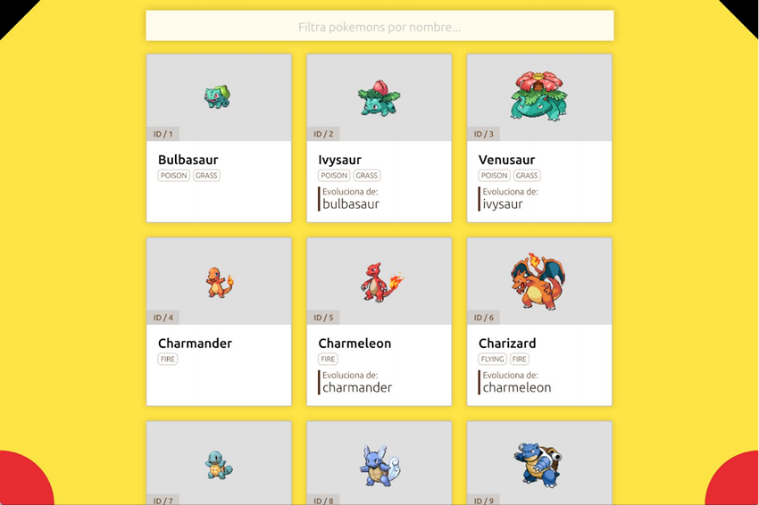

# Adalab Pokemon

## Tech test for Adalab: Pokemon catalog

This technical exercise consists of making a catalog of Pokemons with a field to filter by name.

The data is obtained from the API: https://pokeapi.co/api/v2/pokemon/

To do the exercise:
* The [Wu framework](https://github.com/migueldelmazo/wu) has been used for business logic.
* **React JS** has been used for the views.
* **Sass** has been used for CSS.
* An attempt has been made to create a generic catalog (as far as possible).
  For this reason [`config.json`](./src/config.json) file with **i18n** and **constants** has been created.
